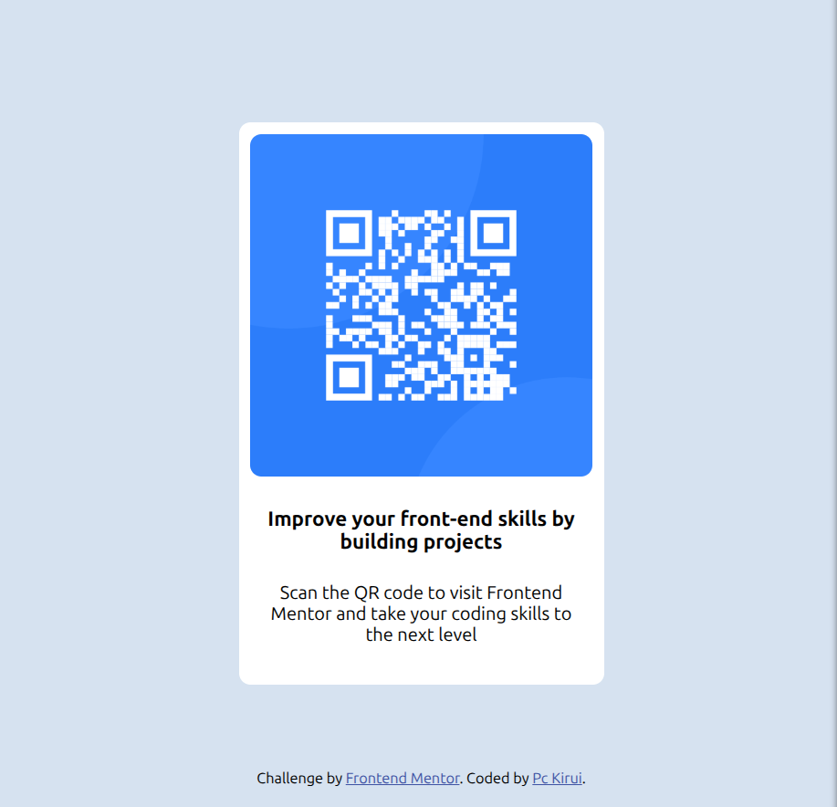

# Frontend Mentor - QR code component solution

This is a solution to the [QR code component challenge on Frontend Mentor](https://www.frontendmentor.io/challenges/qr-code-component-iux_sIO_H). Frontend Mentor challenges help you improve your coding skills by building realistic projects.

## Table of contents

- [Overview](#overview)
  - [Screenshot](#screenshot)
  - [Links](#links)
- [My process](#my-process)
  - [Built with](#built-with)
  - [What I learned](#what-i-learned)
  - [Continued development](#continued-development)
- [Author](#author)

## Overview

### Screenshot



Solution screenshot as viewed from my Pc.

### Links

- Solution URL: [Add solution URL here](https://your-solution-url.com)
- Live Site URL: [Add live site URL here](https://your-live-site-url.com)

## My process

With the designs given I was able to visualize and come with proper ways of handling the problem. Both mobile and desktop version were given implying the project should be responsive across all screens.

Thought of ways to handle dimensions for the qr-container, which allowed the contents to fit in, be readable, responsive and have reasonable limits i.e not tiny on small screens and larger on large screens.

### Built with

- Semantic HTML5 markup
- CSS custom properties
- Flexbox
- Mobile-first workflow

### What I learned

Refreshed my knowledge on the use of max-width css property and flexible height. max-width property prevents the container from becoming too wide on large screens and lets its height be determined by its content.

```html
<div class="qr-container">
  <div class="qr-image">
    
  </div>

  <h2>Improve your front-end skills by building projects</h2>
  <p>
    Scan the QR code to visit Frontend Mentor and take your coding skills to the
    next level
  </p>
</div>
```

```css
.qr-container {
  background-color: hsl(0, 0%, 100%);
  width: 90%;
  max-width: 320px;
  padding: 1rem;
  border-radius: 1rem;
}
```

[The Markdown Guide](https://www.markdownguide.org/)

### Continued development

- CSS values and units
- Responsive layouts

## Author

- Website - [Patrick Cheruiyot Kirui](https://pc-kirui.github.io/)
- Frontend Mentor - [@Pc-Kirui](https://www.frontendmentor.io/profile/Pc-Kirui)
